# Simple websites to improve JS skills

Written using only JavaScript's standard library.

### snake-game:
Playing grid is divided into a 21 x 21 grid, and it automatically resizes based on window size. Allows user to adjust the speed of the game, and detects both self-collisions and wall collisions. Turn snake left or right using the "a" and "d" keys.

Game in progress:

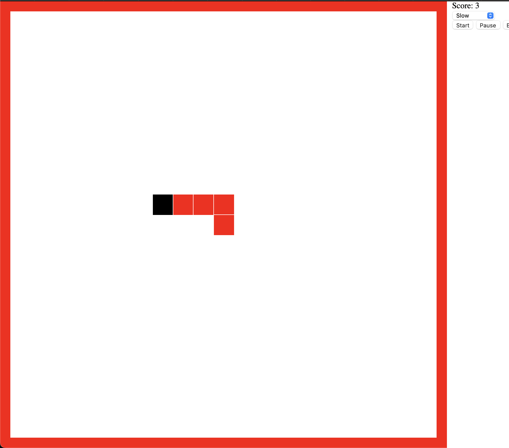

Game ending after collisions:

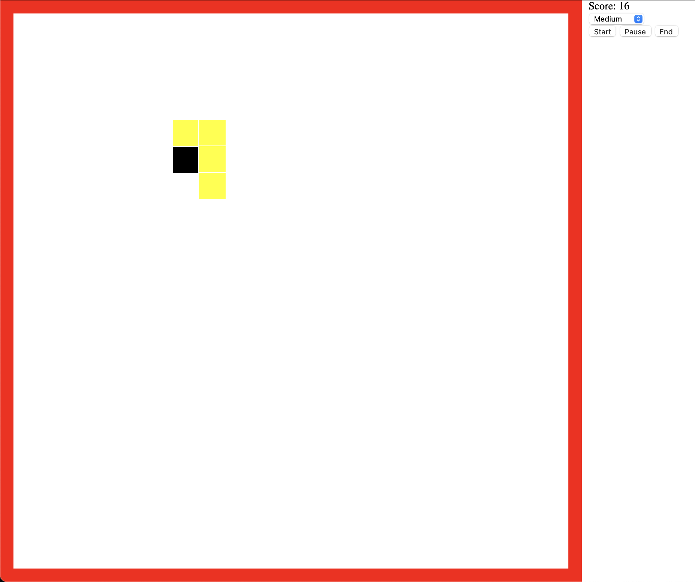  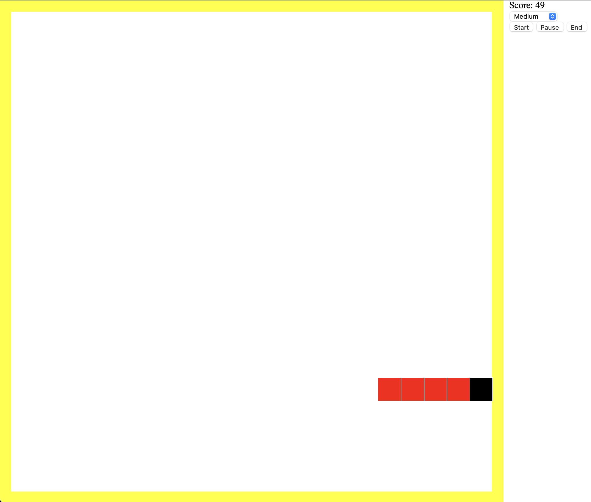

## shooting-game: 
Targets of different sizes and point values appear in a random location, and the user must click them to "shoot" them. Used to practice coding timeouts and intervals

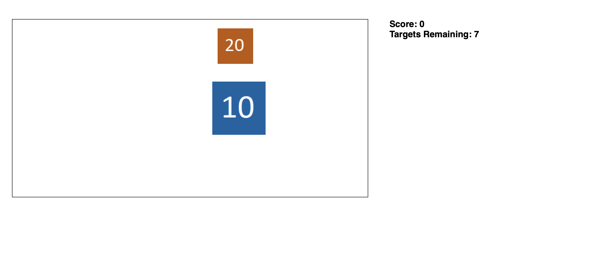

## card-game: 
A card matching game to practice with timeouts.
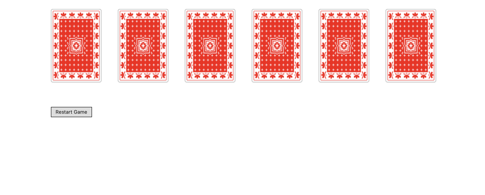
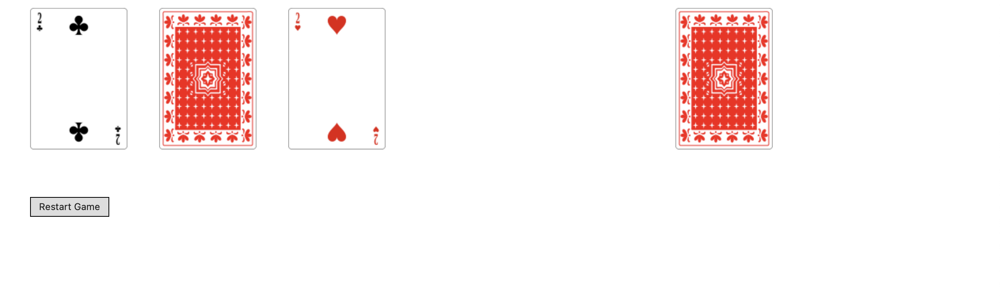

## stanford-map: 
Used 4 stanford campus map images of different resolutions to provide a dynamic map with a zoom feature. Supports panning with the mouse or using arrow buttons to move across the map.

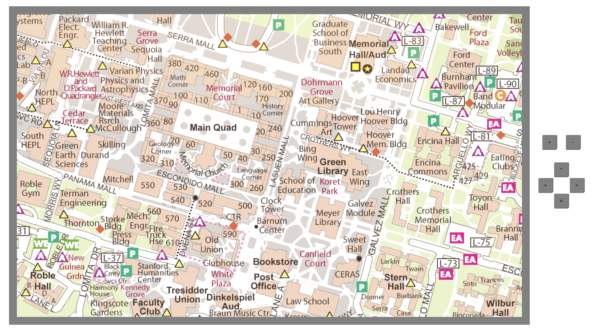
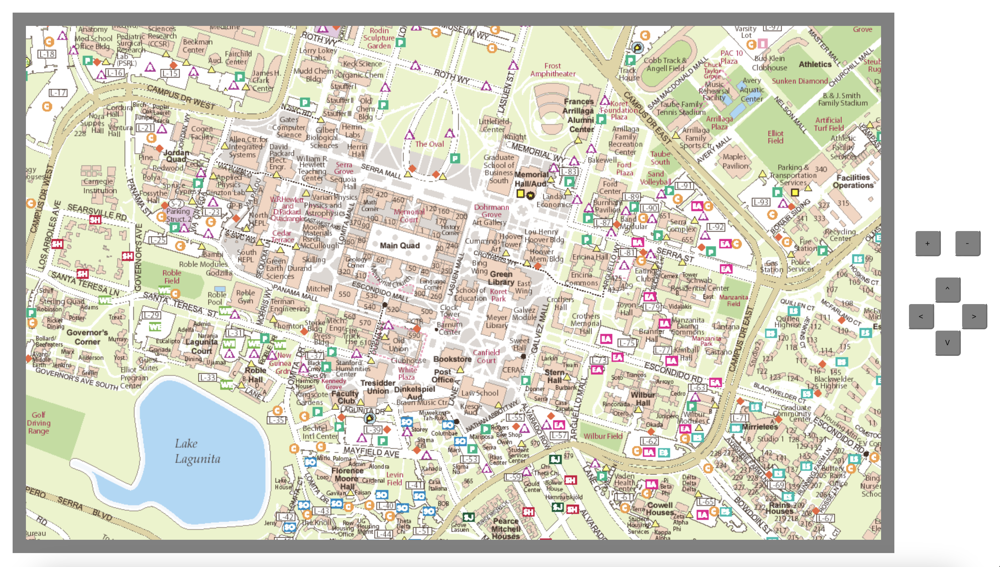

## college-filter: 
Practice dynamically updating a table depending on user-input filter values.

## inventory-system: 
User can insert items into an inventory and filter them based on name and category.

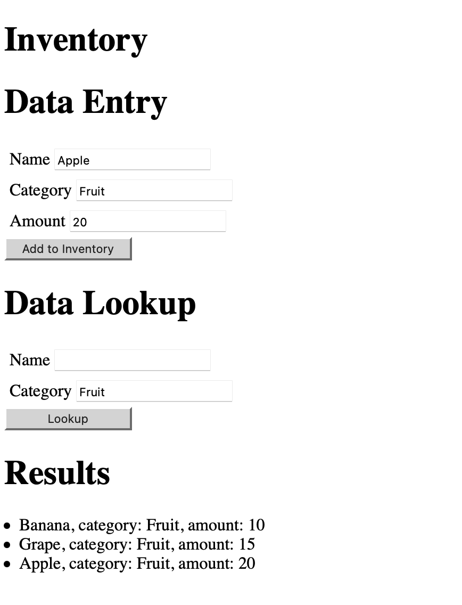

## car-purchase-site: 
Practice with inputs: Radio buttons, checkboxes, and select tags.

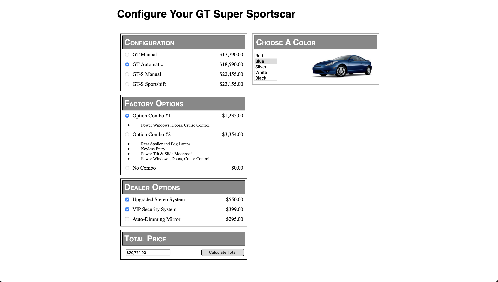

## draw-rectangle: 
The user can do two mouse clicks on the screen to draw a rectangle of any size or location. Then, they can use a settings box to update the rectangle. Practice with saving state in order to block the creation of more rectangles and dynamically changing the size of objects.

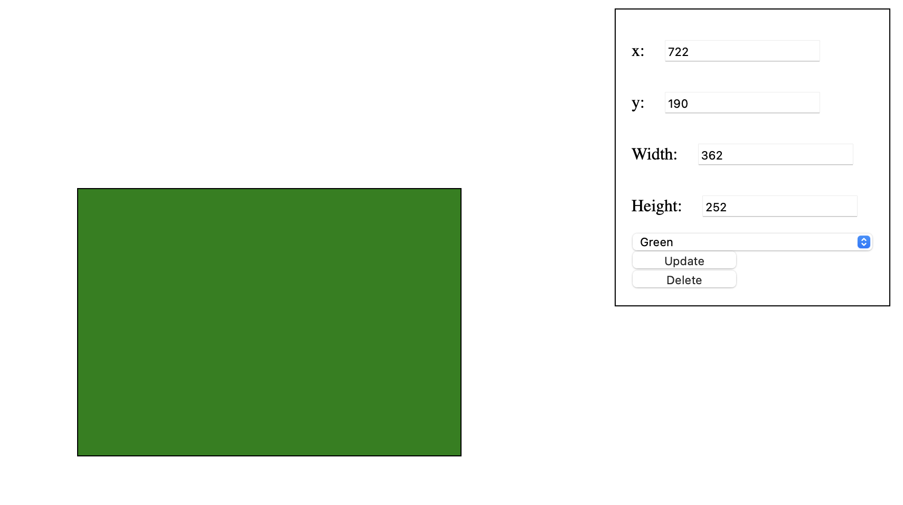

## image-gallery: 
Webpage that allows clicking through a set of pre-loaded images.

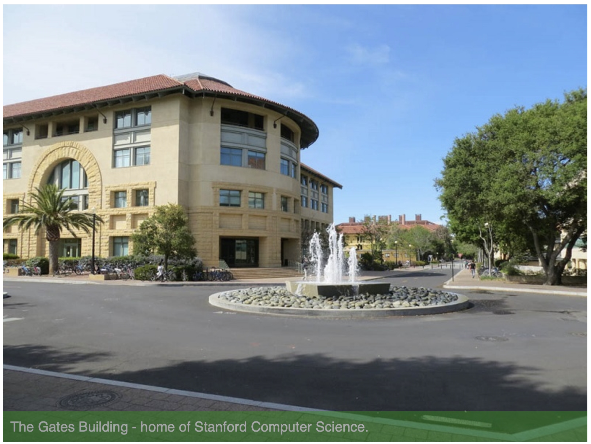  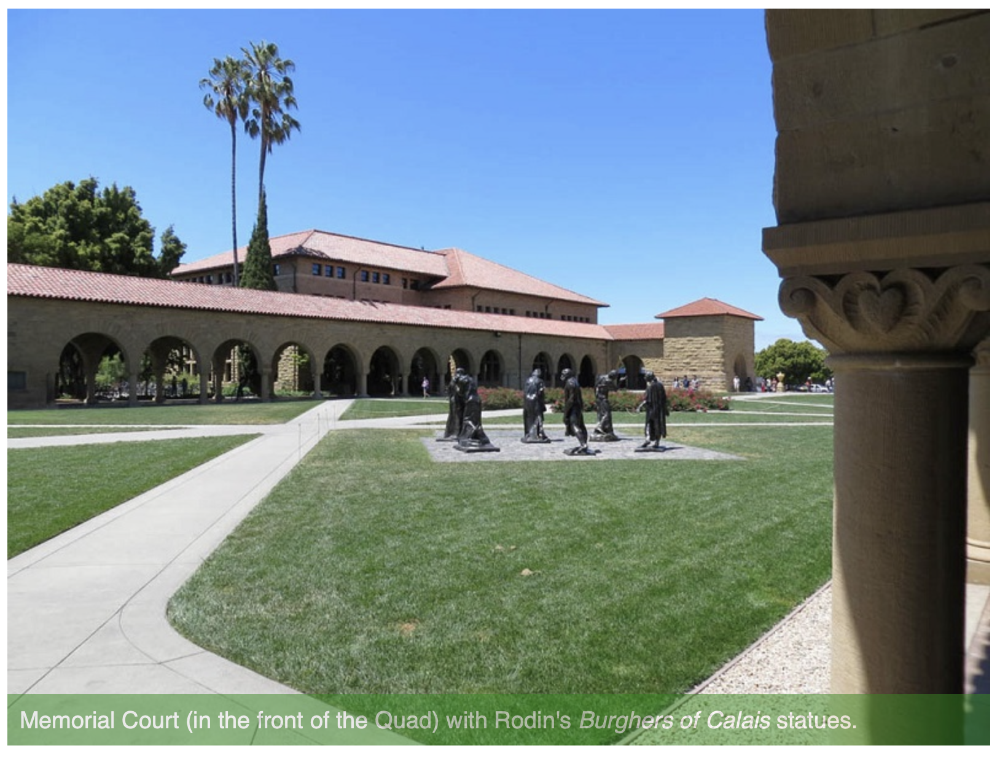

## auto-adjusting-size: 
This was used to practice dynamically changing the page layout based on the current width of the user's browser.

Small browser width:

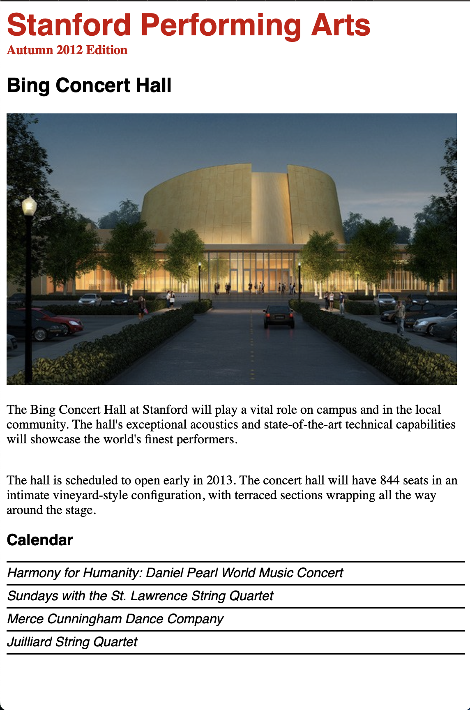

Medium browser width:

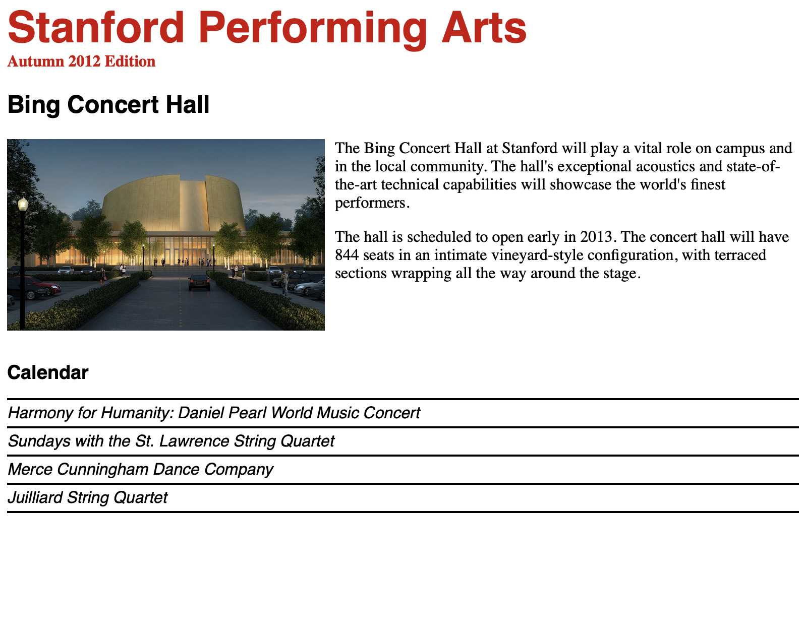

Wide browser width:

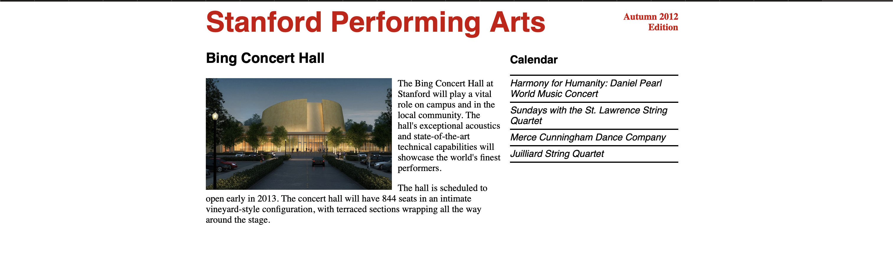
